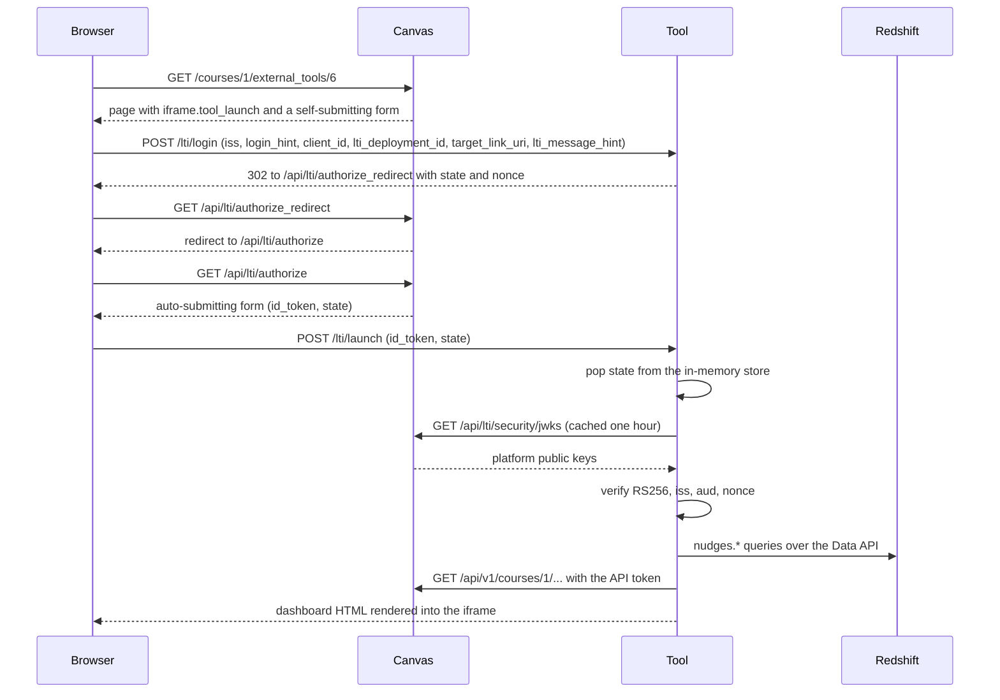

# LTI 1.3, as this POC uses it

This is the explainer for D:\Canvas\lti-dashboard. It assumes no prior contact with LTI. The
commands to run the tool live in the README one level up.

## What LTI 1.3 is

LTI stands for Learning Tools Interoperability. It is the standard that lets a learning platform
open an outside web app inside its own pages and tell that app who is looking at it. Canvas is
the platform. Our dashboard at http://localhost:8800 is the tool. A launch is a signed handoff
from the platform to the tool. The handoff says who the user is, which course they are in, what
role they hold there, and which spot in the Canvas UI they clicked.

Two older standards do the work underneath. OIDC (OpenID Connect) is the login protocol that
carries the handoff through the browser as a pair of redirects. A JWT (JSON Web Token) is the
signed document Canvas hands over at the end, a JSON object with a signature the tool checks
against the public key Canvas publishes. LTI 1.3 adds a set of named claims to that JWT (the
user's roles, the course, the placement) and nothing else.

Canvas never has to reach the tool for a launch. The browser carries every step. The tool has to
reach Canvas twice, once for the public keys that verify the token and once for the live REST
reads on the page.

## Placements

A placement is a spot in the Canvas UI where a tool can appear. The list is fixed in Canvas
(app/models/lti/resource_placement.rb) and includes account_navigation, course_navigation,
global_navigation, the assignment_* hooks, and link_selection. There is no dashboard placement.
Nothing lets a tool draw on the Canvas dashboard page itself, which is why this tool is a page
of its own.

course_navigation is the primary placement. It puts a Performance Dashboard link in the left nav
of every course, and a launch from there carries the course context. Both views need that
context. The student view needs a course to look the student up in, and the teacher view needs a
course to list.

global_navigation is secondary. It adds the same link to the global menu on the far left. A
launch from there has no course. Canvas leaves `$Canvas.course.id` unsubstituted in the custom
claim, `lti.py` fails to parse it as an integer, and the tool falls back to course 1. That is
enough for a one-course POC. The six-week build would give the global launch a course picker.

## The launch flow



The same chain in order, as recorded from a real student launch:

1. The browser opens http://localhost:3100/courses/1/external_tools/6. Canvas renders the page with an iframe.tool_launch and a self-submitting form inside it.
2. The form POSTs to http://localhost:8800/lti/login with iss, login_hint, client_id, lti_deployment_id, target_link_uri, and lti_message_hint.
3. The tool makes a state and a nonce, stores them, and answers 302 to http://localhost:3100/api/lti/authorize_redirect with scope=openid, response_type=id_token, response_mode=form_post, prompt=none, client_id=10000000000003, redirect_uri=http://localhost:8800/lti/launch, and the login_hint, state, nonce, and lti_message_hint.
4. Canvas redirects to http://localhost:3100/api/lti/authorize with the same parameters and returns an auto-submitting form.
5. The form POSTs to http://localhost:8800/lti/launch with id_token and state.
6. The tool pops the state from its store. It fetches http://localhost:3100/api/lti/security/jwks (PyJWKClient caches the keys), verifies the RS256 signature, checks that iss is https://canvas.instructure.com, that aud equals the client_id, and that the nonce matches the stored one.
7. The tool reads Redshift and the Canvas REST API in parallel threads and renders the page into the iframe.

### Why there are no cookies

Most LTI libraries set a cookie in step 3 and read it in step 5 to tie the two requests
together. This tool sets none. The launch runs inside an iframe over plain http on localhost. A
cookie that has to cross into an iframe from another site must be SameSite=None, a
SameSite=None cookie must also be Secure, and the browser refuses a Secure cookie over http. So
the state and nonce live in a module-level dict in `lti.py`, keyed by state, with a 5-minute TTL
and single use. Step 5 looks the state up and deletes it, and a second POST with the same state
gets a 400. The browser carries nothing but the form fields.

The cost is one process. A second uvicorn worker would hold its own dict and reject every launch
whose login hit the other worker. Run the tool without `--workers`.

The placement's windowTarget was left at its default, so the dashboard opens in the iframe and
sits inside Canvas like a native page instead of in a new tab.

## What the id_token contains

This is docs/id-token-claims-elena.json, captured from `/debug/last-claims` after Elena's real
launch and trimmed to the claims the tool reads. sub, email, picture and the lis values are
redacted in the file. The claims not shown here (resource_link, tool_platform, version, lti1p1,
lti11_legacy_user_id, eulaservice, given_name, family_name, locale, azp, iat) are omitted.

```json
{
  "iss": "https://canvas.instructure.com",
  "aud": "10000000000003",
  "nonce": "tL2IsrIAjd_5Zst5CwlmoCciHNViyt8RA0Tr3rs3xTg",
  "exp": 1789490203,
  "name": "Elena Rossi",
  "https://purl.imsglobal.org/spec/lti/claim/message_type": "LtiResourceLinkRequest",
  "https://purl.imsglobal.org/spec/lti/claim/deployment_id": "6:8865aa05b4b79b64a91a86042e43af5ea8ae79eb",
  "https://purl.imsglobal.org/spec/lti/claim/context": {
    "id": "4dde05e8ca1973bcca9bffc13e1548820eee93a3",
    "label": "SAT-101",
    "title": "SAT Prep Sandbox",
    "type": ["http://purl.imsglobal.org/vocab/lis/v2/course#CourseOffering"]
  },
  "https://purl.imsglobal.org/spec/lti/claim/roles": [
    "http://purl.imsglobal.org/vocab/lis/v2/institution/person#Student",
    "http://purl.imsglobal.org/vocab/lis/v2/membership#Learner",
    "http://purl.imsglobal.org/vocab/lis/v2/system/person#User"
  ],
  "https://purl.imsglobal.org/spec/lti/claim/custom": {
    "canvas_user_id": "6",
    "canvas_course_id": "1"
  },
  "https://purl.imsglobal.org/spec/lti/claim/launch_presentation": {
    "document_target": "iframe",
    "return_url": "http://localhost:3100/courses/1/external_content/success/external_tool_redirect",
    "locale": "en",
    "height": 400,
    "width": 800
  },
  "https://www.instructure.com/placement": "course_navigation"
}
```

What each claim means and what the tool does with it:

- `iss` names the signer. Canvas signs as https://canvas.instructure.com whatever host it runs on, so the tool pins that string rather than the localhost URL.
- `aud` is the audience, and for LTI it is the developer key's client_id. `verify_id_token` refuses a token minted for another key.
- `nonce` is the random value the tool put in the step 3 redirect. Canvas copies it back, and the tool compares it against the stored one so a captured token cannot be replayed into a different launch.
- `exp` is a Unix time. Canvas issues tokens that last one hour. PyJWT rejects an expired one.
- `name` is the display name. The page header prints it.
- `message_type` is LtiResourceLinkRequest, the plain "open this tool" message. Deep linking and grade services use other types.
- `deployment_id` identifies the install. Canvas builds it from the account tool id (6) and a hash. One key can be deployed many times, and each deployment gets its own id.
- `context` is the course. `label` is the course code, `title` the name, and `type` says it is a course offering rather than a group or an account. The page header prints the title.
- `roles` is the list `lti.py` scans to choose the view. The three vocabularies are institution (who the person is to the school), membership (what they are in this course), and system (their Canvas-wide standing).
- `custom` carries the developer-key custom fields after substitution. canvas_user_id=$Canvas.user.id became "6" and canvas_course_id=$Canvas.course.id became "1". These two integers are the join key to Redshift user_id and course_id and to the Canvas REST API. `sub` is an opaque LTI user id and cannot be used for either.
- `launch_presentation` says how Canvas rendered the tool. document_target is iframe, and the height and width are Canvas's defaults, not the real frame size.
- The placement claim is Canvas's own extension and names the placement clicked. course_navigation here. A global launch says global_navigation.

## How the tool decides the view and where each number comes from

`launch_from_claims` sets `is_educator` when any role string contains `#Instructor`,
`#TeachingAssistant`, or `#Administrator`. Every other launch gets the student view. Elena's
roles were institution/person#Student, membership#Learner, and system/person#User, so she saw
her own page. The admin's roles were institution/person#Administrator,
institution/person#Instructor, membership#Instructor, system/person#SysAdmin, and
system/person#User, so the admin saw all students.

Every section on the page carries a badge naming its origin, and under the badge the exact table
or request it came from.

The student view has five sections, fetched in parallel threads. Course status, Assignments and
Recommendations are HISTORY. They come from Redshift tables nudges.student_course_status,
nudges.assignment_status and nudges.recommendations, filtered by course_id and user_id from the
custom claim. The redshift project seeded the first two and the nudge-agent project writes the
third. Each Recommendations row links to the Canvas module item the nudge agent's next-step
resolver picks for it, and the link href is nudges.recommendations.next_url, which the resolver
fills from nudges.content_items. Enrollment and Submissions are LIVE. They are Canvas REST reads
made at render time with the API token, `GET /api/v1/courses/1/enrollments?user_id=6&type[]=StudentEnrollment&include[]=total_scores`
and `GET /api/v1/courses/1/students/submissions?student_ids[]=6&include[]=assignment&per_page=50`.

The teacher view is one table. The HISTORY rows are nudges.student_course_status for the whole
course ordered by risk_score, and a LIVE read of `GET /api/v1/courses/1/enrollments?type[]=StudentEnrollment&include[]=total_scores&per_page=100`
is joined on user_id to add live_current_score and live_last_activity_at. A dash in a LIVE
column means Canvas returned no value for that student.

A section whose fetch fails renders an error box where its rows would be. The other sections
still render. docs/launch-elena.png.txt and docs/launch-admin.png.txt hold the page text from
the two verified launches.

## Registration

Registration tells Canvas about the tool once, and every later launch reuses it. Canvas has to
know the tool's login URL, its launch URL, where to find its public key, which custom fields to
substitute, and which placements to show. The tool serves that whole description at
http://localhost:8800/config.json. Canvas then issues a client_id, which is the one value the
tool has to know about Canvas beyond its URL.

`uv run scripts/register_tool.py` does it in five API calls and is safe to rerun. It creates an
LTI 1.3 developer key named "Kaplan Performance Dashboard" through
`POST /api/lti/accounts/1/developer_keys/tool_configuration`, binds the key on for account 1,
unlocks the registration with `PUT /api/v1/accounts/1/lti_registrations/{id}` and
`{"lock_deploying": false}`, then installs the tool once at the account level with
`POST /api/v1/accounts/1/external_tools` and `{"client_id": ...}`. On a rerun it also pushes the
current /config.json into the key with `PUT /api/lti/developer_keys/{client_id}/tool_configuration`,
and Canvas copies the change to the installed tool, which is how the global navigation icon
(icon_url http://localhost:8800/icon.svg) reached tool 6 without a reinstall. One account install carries
both placements. `--show` prints the current state without changing anything. The recorded
result is client_id 10000000000003, registration id 2, account tool id 6, course launch URL
http://localhost:3100/courses/1/external_tools/6, and global launch URL
http://localhost:3100/accounts/1/external_tools/6?launch_type=global_navigation&toolId=performance-dashboard-6.

The same thing by hand in the Canvas UI. Go to Admin > Developer Keys > + Developer Key > + LTI
Key, choose the method Paste JSON, paste the JSON from http://localhost:8800/config.json, save,
and set the key's state to ON. Then go to Admin > Settings > Apps > + App, choose the
configuration type By Client ID, and paste the client id.

## Local pitfalls and how they were handled

- Iframe cookies. Covered above. No cookies, a server-side state dict instead.
- lock_deploying. Canvas's Lti::CreateRegistrationService hardcodes lock_deploying true on every key it mints, and with the dev feature flag lock_lti_registrations on, a client_id install then fails with 403 "This app has been locked by an administrator". The script clears the flag with the PUT before installing.
- Duplicate tab. A course-level install on top of the account-level one produced two identical Performance Dashboard tabs in the course nav. The course install was removed, and the script installs at the account level only.
- Hidden teacher nav. For teachers Canvas collapses the course nav behind the hamburger, so the link exists but is not visible. scripts/verify_launch.mjs records whether the link is visible and then navigates to its href in both
  cases, because a click can also race this one-request-at-a-time Canvas and time out.
- Docker JWKS URL. Canvas runs in the cplatform-web-1 container, where localhost is the container. public_jwk_url is http://host.docker.internal:8800/.well-known/jwks.json, which resolves to 192.168.65.254 from inside the container. The launch itself never uses it. It matters only if Canvas fetches the tool key server-side for LTI Advantage services. The tool binds 0.0.0.0 so that address can reach it.
- Slow dev Canvas. This Rails instance serves one request at a time at about 6 seconds each. The tool fetches its sections in parallel threads and gives Canvas 30 seconds. A paused Redshift Serverless workgroup adds a few seconds on the first query, and the statement poll waits up to 60.

## From POC to the six-week dashboard

The launch code does not change. `lti.py` already verifies a real Canvas token and already
extracts the two ids the data layer needs. Three things do change. The seeded nudges tables give
way to the real Atom feeds or Canvas Data 2 loaded into Redshift, and `data.py` points its SQL at
those tables. The tool moves from a laptop to EC2 behind https, and `config.py` gets the public
URLs. The global launch gets a course picker so the course 1 fallback goes away.

## What changes for production

- https everywhere. Canvas refuses http launch URLs outside dev, and https also makes SameSite=None cookies possible if a later library wants them.
- Key rotation. `/.well-known/jwks.json` serves one key today. Serve the new key next to the old one, wait until every outstanding token could have expired, then drop the old one.
- A shared state store. Replace the process dict in `lti.py` with Redis or a database table with the same 5-minute TTL and single use, so more than one worker and more than one host can share launches.
- Canvas Data instead of seed rows, on a schedule, with the same nudges.* shape or a view over the new one.
- LTI Advantage services if grades or the roster are needed server-side. That is where public_jwk_url starts to matter, because the tool signs its own JWT to get a service token and Canvas verifies it against that URL.
- A real allowlist on redirect_uri. `begin_login` today forwards target_link_uri from the request into redirect_uri. Compare it against the configured launch URL and refuse anything else.
- Key file permissions. `keys/tool.pem` is chmod 600 on creation, which Windows ignores. On the server, keep it out of the repo, readable by the service user only, or move it to a secrets manager.
